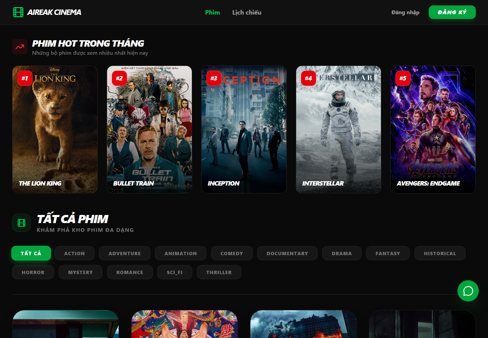
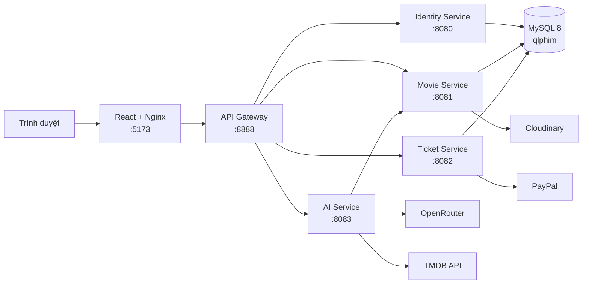
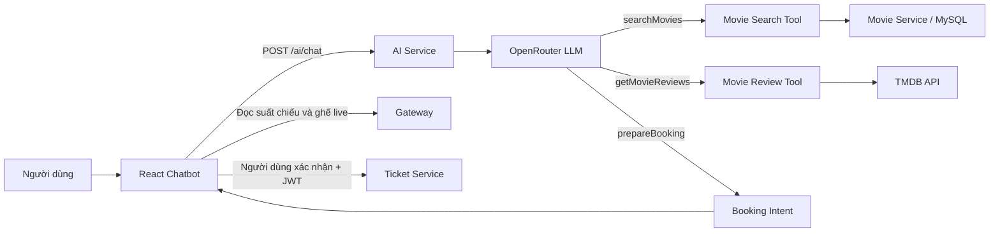

<h1 align="center">🎬 Aireak Cinema</h1>

<p align="center">
  Hệ thống quản lý rạp phim và đặt vé trực tuyến theo kiến trúc microservices,<br>
  tích hợp chatbot AI để tìm phim, xem đánh giá từ TMDB và chuẩn bị đặt vé bằng ngôn ngữ tự nhiên.
</p>

<p align="center">
  
  
  
  
  
</p>

## Mục lục

- [Giới thiệu](#giới-thiệu)
- [Giao diện](#giao-diện)
- [Tính năng](#tính-năng)
- [Kiến trúc hệ thống](#kiến-trúc-hệ-thống)
- [Thiết kế chatbot AI](#thiết-kế-chatbot-ai)
- [Công nghệ sử dụng](#công-nghệ-sử-dụng)
- [Cấu trúc dự án](#cấu-trúc-dự-án)
- [Khởi chạy nhanh bằng Docker](#khởi-chạy-nhanh-bằng-docker)
- [Chạy ở chế độ phát triển](#chạy-ở-chế-độ-phát-triển)
- [Tài liệu API](#tài-liệu-api)
- [Cơ sở dữ liệu](#cơ-sở-dữ-liệu)
- [Build và kiểm thử](#build-và-kiểm-thử)
- [Giới hạn hiện tại](#giới-hạn-hiện-tại)
- [Lưu ý bảo mật](#lưu-ý-bảo-mật)
- [Xử lý sự cố](#xử-lý-sự-cố)
- [Giấy phép](#giấy-phép)

## Giới thiệu

Aireak Cinema phục vụ hai nhóm người dùng:

- **Khách hàng:** đăng ký/đăng nhập, duyệt phim và lịch chiếu, chọn ghế, thanh toán PayPal, xem lịch sử và hủy vé.
- **Quản trị viên:** quản lý phim, thể loại, lịch chiếu, tài khoản, hóa đơn và theo dõi dashboard thống kê đặt vé.

Mọi request API nghiệp vụ từ giao diện được gửi tới API Gateway. Gateway chuyển tiếp request đến đúng microservice, giữ nguyên body, header (bao gồm JWT) và response streaming. Ba service nghiệp vụ dùng chung MySQL; AI Service gọi Movie Service để lấy dữ liệu nội bộ, đồng thời gọi OpenRouter và TMDB cho các chức năng AI.

## Giao diện

<p align="center">
  
</p>

<p align="center"><em>Trang chủ Aireak Cinema được chụp từ hệ thống chạy thật bằng Docker Compose với dữ liệu seed của dự án.</em></p>

## Tính năng

### Khách hàng

- Đăng ký, đăng nhập bằng email/mật khẩu; mật khẩu được băm bằng BCrypt.
- Xem danh sách phim có phân trang và lọc theo thể loại.
- Xem chi tiết phim, lịch chiếu theo phim hoặc theo ngày.
- Xem sơ đồ ghế theo thời gian thực với ba loại ghế: `STANDARD`, `VIP`, `COUPLE`.
- Tạo hóa đơn `PENDING`, đánh dấu ghế `BOOKED` ngay khi đặt, chuyển sang PayPal Sandbox và cập nhật hóa đơn thành `PAID` sau khi capture thành công. Hiện chưa có TTL tự giải phóng ghế nếu người dùng rời luồng thanh toán mà không quay lại callback.
- Xem chi tiết hóa đơn, lịch sử đặt vé và hủy vé trước giờ chiếu tối thiểu 1 giờ. Thao tác hủy hiện trả ghế và xóa dữ liệu local nhưng chưa tự động hoàn tiền PayPal.
- Xem và cập nhật hồ sơ cá nhân.

### Quản trị viên

- Dashboard theo tháng: số phim chiếu, số vé được tạo, tổng giá trị hóa đơn, top 5 phim theo số vé và khung giờ tạo hóa đơn phổ biến. Truy vấn hiện tính cả hóa đơn `PENDING` và `PAID`.
- Thêm, sửa, xóa phim; upload ảnh lên Cloudinary.
- Thêm, xóa thể loại.
- Tạo lịch chiếu, cấu hình giá theo loại ghế và xóa lịch chiếu chưa phát sinh vé.
- Tìm kiếm/lọc lịch chiếu và hóa đơn.
- Xem danh sách khách hàng và bật/tắt trạng thái tài khoản.

### Chatbot AI

- Tìm kiếm phim nội bộ theo thể loại, từ khóa, đạo diễn, diễn viên, ngôn ngữ và lịch chiếu; hỗ trợ sắp xếp theo thời lượng.
- Hỗ trợ sắp xếp tập phim đã truy vấn theo ngày thêm hoặc thời lượng; trả top 5 phim theo số vé được tạo trong tháng.
- Lấy điểm số, tổng quan và trích đoạn đánh giá phim từ TMDB.
- Hiểu yêu cầu đặt vé tự nhiên, ví dụ: “Đặt 2 vé Inception tối mai, ưu tiên VIP ngồi giữa”.
- Chỉ tạo bản xem trước từ lịch chiếu và ghế trống hiện tại; người dùng vẫn phải xác nhận trên giao diện trước khi tạo vé.
- Duy trì ngữ cảnh theo `conversationId`, có memory window và replay cache trong RAM để giảm số lần gọi model.

## Kiến trúc hệ thống



| Thành phần | Cổng mặc định | Vai trò chính |
| --- | ---: | --- |
| Frontend | `5173` | React SPA phục vụ qua Vite khi dev hoặc Nginx khi chạy Docker |
| API Gateway | `8888` | Reverse proxy, CORS và định tuyến request |
| Identity Service | `8080` | Tài khoản, BCrypt, JWT và phân quyền `ADMIN`/`CUSTOMER` |
| Movie Service | `8081` | Phim, thể loại, lịch chiếu, phòng, upload ảnh và thống kê |
| Ticket Service | `8082` | Ghế, vé, hóa đơn, hủy vé và thanh toán PayPal |
| AI Service | `8083` | Chatbot LangChain4j, tool calling, OpenRouter và TMDB |
| MySQL | `3306` | Lưu dữ liệu nghiệp vụ trong schema `qlphim` |

## Thiết kế chatbot AI

Chatbot dùng **LLM tool calling**, không triển khai RAG. Dự án không có embedding model, vector database, document ingestion hoặc retriever.



- LLM hiểu ngôn ngữ tự nhiên, chọn tool và tạo arguments JSON.
- Backend mới là thành phần truy vấn dữ liệu và thực thi quy tắc nghiệp vụ.
- `searchMovies` lấy phim/lịch chiếu/thống kê từ hệ thống nội bộ.
- `getMovieReviews` lấy rating, overview và trích đoạn review từ TMDB.
- `prepareBooking` chỉ tạo intent. Frontend kiểm tra suất/ghế live và chỉ gọi API đặt vé sau khi người dùng xác nhận.
- Memory, transcript và cache hiện nằm trong RAM của một AI Service instance; restart container sẽ làm mất dữ liệu này.

## Công nghệ sử dụng

### Backend

- Java 21, Maven multi-module.
- Quarkus 3.35.2, Quarkus REST, CDI.
- Hibernate ORM with Panache, MySQL JDBC.
- SmallRye JWT và Jakarta Security.
- LangChain4j 0.36.2, OpenRouter-compatible API.
- Cloudinary Java SDK và PayPal REST API.

### Frontend

- React 19.2, TypeScript 6, Vite 8.
- Tailwind CSS 4, Lucide React.
- Axios, React Router 7, date-fns và Recharts.

### Hạ tầng

- Docker multi-stage build.
- Docker Compose.
- Nginx phục vụ production SPA.
- MySQL 8 với script seed tự động.

## Cấu trúc dự án

```text
.
├── api_gateway/                  # Gateway chuyển tiếp request đến các service
├── identity_service/             # Xác thực, tài khoản và JWT
├── movie_service/                # Phim, lịch chiếu, phòng và thống kê
├── ticket_service/               # Đặt vé, hóa đơn và PayPal
├── ai_service/                   # Chatbot, AI tools và REST clients
├── film_management_frontend/     # React + TypeScript SPA
├── database_qlphim/
│   └── aireak_cinema_db.sql      # Schema và dữ liệu mẫu
├── docs/images/                   # Ảnh minh họa dùng trong README
├── .env.example                  # Mẫu biến môi trường, không chứa secret thật
├── docker-compose.yml            # Chạy toàn bộ hệ thống
├── dev.ps1                       # Mở các service ở dev mode trên Windows
├── pom.xml                       # Parent POM và danh sách Maven modules
└── README.md
```

## Khởi chạy nhanh bằng Docker

Đây là cách đơn giản nhất để chạy đầy đủ hệ thống.

### 1. Yêu cầu

- Git.
- Docker Desktop hoặc Docker Engine có Docker Compose.
- Tài khoản/API key cho OpenRouter, TMDB, Cloudinary và PayPal Sandbox.

Java, Maven, Node.js và MySQL không cần cài trực tiếp nếu chỉ dùng Docker.

### 2. Clone repository

```bash
git clone https://github.com/Minh-aireak/FilmManagement-IntegratedAI-Quarkus.git
cd FilmManagement-IntegratedAI-Quarkus
```

### 3. Tạo file `.env`

Sao chép file mẫu tại thư mục gốc:

```bash
# macOS / Linux / Git Bash
cp .env.example .env
```

```powershell
# Windows PowerShell
Copy-Item .env.example .env
```

Sau đó mở `.env`, thay toàn bộ giá trị `your_*` và đổi `change_me` thành mật khẩu MySQL local. Không commit file `.env`.

Các ràng buộc cấu hình hiện tại:

- `DATABASE_NAME` phải là `qlphim` vì JDBC URL và file SQL đang dùng cố định tên này.
- `DB_PASSWORD` phải giống `DATABASE_ROOT_PASSWORD` vì các service hiện kết nối bằng user MySQL `root`.
- Nên giữ frontend ở `5173` và gateway ở `8888`. Nếu đổi cổng, cần cập nhật thêm CORS trong các file `application.properties`, `PAYPAL_FRONTEND_URL` và `API_BASE_URL` trong `film_management_frontend/src/services/api.ts`.

### 4. Build và chạy

```bash
docker compose up --build -d
docker compose ps
```

Sau khi các container sẵn sàng:

- Giao diện: <http://localhost:5173>
- API Gateway: <http://localhost:8888>
- AI health check: <http://localhost:8888/ai/health>

Theo dõi log:

```bash
docker compose logs -f
```

Dừng hệ thống nhưng giữ dữ liệu MySQL:

```bash
docker compose down
```

> [!WARNING]
> `docker compose down -v` sẽ xóa volume `mysql_data` và toàn bộ dữ liệu local. Lần chạy tiếp theo, file SQL seed sẽ được import lại từ đầu.

## Chạy ở chế độ phát triển

### Yêu cầu

- JDK 21.
- Node.js 22 và npm.
- Maven 3.9+ hoặc Maven Wrapper trong repository.
- MySQL 8 đang chạy với schema `qlphim`.
- Các biến môi trường API tương tự phần Docker.

Có thể chỉ chạy database bằng Docker:

```bash
docker compose up -d db
```

Khi backend chạy trực tiếp trên máy, dùng các host local sau:

```dotenv
DB_HOST=localhost
DB_PORT=3306
IDENTITY_SERVICE_HOST=localhost
MOVIE_SERVICE_HOST=localhost
TICKET_SERVICE_HOST=localhost
AI_SERVICE_HOST=localhost
```

Đồng thời export `DB_PASSWORD`, các key OpenRouter/TMDB/Cloudinary/PayPal và đặt `PAYPAL_FRONTEND_URL=http://localhost:5173/payment-result` trong terminal trước khi khởi chạy.

### Windows: script hỗ trợ

Sau khi các biến môi trường đã được thiết lập trong PowerShell:

```powershell
.\dev.ps1
```

Script mở sáu cửa sổ riêng cho năm module backend và frontend. Tuy nhiên, `dev.ps1` hiện gọi file Unix `./mvnw`; trên Windows có thể cần sửa các lệnh đó thành `.\mvnw.cmd` hoặc chạy thủ công theo mục tiếp theo. Nếu PowerShell chặn script local, có thể chạy:

```powershell
powershell -ExecutionPolicy Bypass -File .\dev.ps1
```

### Chạy thủ công

Mở một terminal cho mỗi service:

```bash
./mvnw -pl identity_service quarkus:dev
./mvnw -pl movie_service quarkus:dev
./mvnw -pl ticket_service quarkus:dev
./mvnw -pl ai_service quarkus:dev
./mvnw -pl api_gateway quarkus:dev
```

Trên Windows, thay `./mvnw` bằng `.\mvnw.cmd`.

> [!NOTE]
> Maven Wrapper hiện có thể báo `Cannot index into a null array` trên một số phiên bản PowerShell. Khi gặp lỗi này, dùng Maven 3.9+ đã cài (`mvn ...`) hoặc chạy wrapper từ Git Bash sau khi đã cấu hình Bash hợp lệ.

Chạy frontend trong terminal khác:

```bash
cd film_management_frontend
npm ci
npm run dev
```

Quarkus Dev UI của từng backend có tại `http://localhost:<service-port>/q/dev/` khi chạy dev mode.

## Tài liệu API

Base URL dùng từ frontend hoặc client bên ngoài:

```text
http://localhost:8888
```

Các endpoint có ký hiệu **JWT** yêu cầu header:

```http
Authorization: Bearer <access_token>
```

Token do Identity Service phát hành có role `ADMIN` hoặc `CUSTOMER` và hết hạn sau 1 giờ.

### Identity Service

| Method | Endpoint | Quyền | Mô tả |
| --- | --- | --- | --- |
| `POST` | `/auth/register` | Public | Đăng ký tài khoản `CUSTOMER` |
| `POST` | `/auth/login` | Public | Đăng nhập và nhận JWT |
| `GET` | `/accounts` | ADMIN | Danh sách khách hàng |
| `GET` | `/accounts/my-profile` | JWT | Lấy hồ sơ hiện tại |
| `PUT` | `/accounts/update-profile` | JWT | Cập nhật hồ sơ hiện tại |
| `POST` | `/accounts/{id}/toggle-active` | ADMIN | Khóa/mở khóa tài khoản |

### Movie Service

| Method | Endpoint | Quyền | Mô tả |
| --- | --- | --- | --- |
| `GET` | `/movies?page=0&size=10&category=ACTION` | Public | Danh sách phim có phân trang/lọc |
| `GET` | `/movies/{idMovie}` | Public | Chi tiết phim |
| `GET` | `/movies/date/{yyyy-MM-dd}?startTime=19:00&endTime=23:00` | Public | Phim có suất chiếu trong ngày/khung giờ |
| `POST` | `/movies` | ADMIN | Tạo phim |
| `PUT` | `/movies/{idMovie}` | ADMIN | Cập nhật phim |
| `DELETE` | `/movies/{idMovie}` | ADMIN | Xóa phim chưa được sử dụng |
| `GET` | `/categories` | Public | Danh sách thể loại |
| `POST` | `/categories?idCategory=ACTION` | ADMIN | Tạo thể loại |
| `DELETE` | `/categories?idCategory=ACTION` | ADMIN | Xóa thể loại |
| `GET` | `/showtimes/{idMovie}?page=0&size=10` | Public | Lịch chiếu của một phim |
| `GET` | `/showtimes?status=upcoming&page=0&size=10` | Public | Tất cả lịch chiếu; `status`: `upcoming`, `past`, `all` |
| `POST` | `/showtimes` | ADMIN | Tạo lịch chiếu và bảng giá ghế |
| `DELETE` | `/showtimes/{idShowtime}` | ADMIN | Xóa lịch chiếu chưa có vé |
| `GET` | `/rooms` | ADMIN | Danh sách phòng |
| `POST` | `/images/upload` | JWT | Upload multipart field `file` lên Cloudinary |
| `GET` | `/stats/dashboard?month=8&year=2026` | Public | Thống kê theo tháng/năm từ toàn bộ hóa đơn, gồm cả `PENDING` và `PAID` |

`GET /showtimes` còn hỗ trợ các query param `movieId`, `date`, `roomId` và `search`.

Payload tạo lịch chiếu:

```json
{
  "idMovie": "Movie_...",
  "idRoom": "Room_1",
  "showTime": "2026-08-28T19:30:00",
  "standardPrice": 60000,
  "vipPrice": 90000,
  "couplePrice": 150000
}
```

### Ticket Service

| Method | Endpoint | Quyền | Mô tả |
| --- | --- | --- | --- |
| `GET` | `/bookings/seats/{idShowtime}` | Public | Danh sách mã ghế đã đặt |
| `GET` | `/bookings/seats/status/{idShowtime}` | Public | Trạng thái, loại và giá của toàn bộ ghế |
| `POST` | `/bookings` | JWT | Tạo hóa đơn `PENDING`, vé và đánh dấu ghế `BOOKED` ngay lập tức |
| `GET` | `/bookings/payment-url/{idBill}` | JWT | Tạo PayPal approval URL |
| `POST` | `/bookings/paypal/capture/{idBill}?token={orderId}` | JWT | Capture giao dịch PayPal |
| `GET` | `/tickets/bills/{idBill}` | JWT | Chi tiết hóa đơn của chủ sở hữu/admin |
| `GET` | `/tickets/history` | JWT | Lịch sử đặt vé của tài khoản hiện tại |
| `DELETE` | `/tickets/cancel/{idBill}` | JWT | Xóa hóa đơn/vé hợp lệ và trả ghế; không tự động refund PayPal |
| `GET` | `/tickets/admin/bills` | ADMIN | Danh sách hóa đơn có phân trang/lọc |

Payload đặt vé:

```json
{
  "idShowtime": "Showtime_...",
  "seatCodes": ["D4", "D5"]
}
```

### AI Service

| Method | Endpoint | Quyền | Mô tả |
| --- | --- | --- | --- |
| `POST` | `/ai/chat` | Public | Gửi tin nhắn tới chatbot |
| `GET` | `/ai/health` | Public | Health check đơn giản |

Ví dụ request:

```bash
curl -X POST http://localhost:8888/ai/chat \
  -H "Content-Type: application/json" \
  -d '{"conversationId":"demo-01","message":"Gợi ý 5 phim hành động đang chiếu tối nay"}'
```

`POST /ai/chat` có thể trả các loại response: `TEXT`, `MOVIE_LIST`, `MOVIE_DETAIL`, `MOVIE_REVIEW` hoặc `BOOKING_REQUEST`. Với `BOOKING_REQUEST`, frontend tiếp tục truy vấn lịch chiếu/ghế trống và yêu cầu đăng nhập, xác nhận trước khi gọi API tạo vé.

Ví dụ response danh sách phim:

```json
{
  "conversationId": "demo-01",
  "type": "MOVIE_LIST",
  "data": [
    {
      "id": "Movie_...",
      "title": "Inception"
    }
  ],
  "timestamp": "2026-08-28T23:00:00"
}
```

## Cơ sở dữ liệu

File `database_qlphim/aireak_cinema_db.sql` tạo schema `qlphim`, quan hệ khóa ngoại và dữ liệu mẫu. Script được MySQL Docker import **chỉ khi volume database còn trống**.

Các bảng chính:

| Nhóm | Bảng |
| --- | --- |
| Người dùng | `account` |
| Danh mục phim | `movie`, `category`, `movie_category` |
| Phòng và ghế | `room`, `room_seat` |
| Lịch chiếu | `showtime`, `showtime_price`, `showtime_seat` |
| Đặt vé | `bill`, `ticket` |

Seed có sẵn phim, thể loại, phòng, ghế, lịch chiếu, hóa đơn và tài khoản mẫu. Mật khẩu tài khoản seed chỉ được lưu dưới dạng BCrypt, không có mật khẩu plaintext trong repository.

Để có tài khoản admin local, đăng ký một tài khoản mới từ giao diện rồi cập nhật role trong MySQL:

```bash
docker compose exec db mysql -uroot -p qlphim
```

```sql
UPDATE account
SET role = 'ADMIN'
WHERE email = 'your-email@example.com';
```

Đăng xuất và đăng nhập lại để JWT mới chứa role `ADMIN`.

## Build và kiểm thử

### Backend

Build toàn bộ Maven modules theo cách các Dockerfile hiện tại đang sử dụng:

```bash
./mvnw clean package -DskipTests
```

Chạy unit test cho TMDB review tool bằng fake client, không cần gọi mạng:

```bash
./mvnw -pl ai_service -Dtest=MovieReviewToolTest test
```

Live test TMDB mặc định bị skip. Chỉ bật khi đã export `TMDB_API_KEY`:

```bash
./mvnw -pl ai_service -Dtest=TmdbLiveApiTest -Dtmdb.live-tests=true test
```

Trên Windows, thay `./mvnw` bằng `.\mvnw.cmd`.

> [!NOTE]
> Bộ test backend hiện chưa hoàn toàn xanh: `identity_service` và `ticket_service` vẫn còn các `GreetingResourceTest` do Quarkus template tạo ra, trong khi endpoint `/hello` không còn trong source. Vì vậy các Dockerfile chủ động dùng `-DskipTests`. Các test AI nêu trên là những test nghiệp vụ đang có ý nghĩa trong repository.

### Frontend

```bash
cd film_management_frontend
npm ci
npm run build
```

Có thể chạy ESLint riêng bằng `npm run lint`. Lần kiểm tra gần nhất, production build hoàn tất nhưng lint còn `77 errors` và `15 warnings`, gồm `no-explicit-any`, biến không dùng, dependency/immutability của React hooks, cập nhật state trong effect và Fast Refresh. Vite cũng cảnh báo bundle JavaScript chính lớn hơn 500 kB; nên code-split trước khi dùng build/lint làm quality gate production.

## Giới hạn hiện tại

- Các service tách process nhưng vẫn dùng chung schema `qlphim`; chưa đạt database-per-service.
- AI dùng tool calling chứ không phải RAG; chưa có semantic/vector search trên tài liệu.
- Memory/cache chatbot chỉ nằm trong RAM một instance, chưa phù hợp scale ngang.
- Các yêu cầu “phim cũ nhất/dài nhất/ngắn nhất” hiện sort trên trang dữ liệu tool đã fetch, chưa đảm bảo cực trị trên toàn database.
- Booking preview chỉ là snapshot. `ticket-service` kiểm tra lại ghế trong transaction nhưng chưa có pessimistic/optimistic lock, unique constraint giữ ghế hoặc idempotency key hoàn chỉnh.
- Bill `PENDING` chưa có TTL/job tự giải phóng ghế; hủy vé đã thanh toán chưa gọi PayPal refund.
- API tạo URL/capture PayPal mới yêu cầu đăng nhập nhưng chưa kiểm tra chủ sở hữu hóa đơn như endpoint xem chi tiết.
- Dashboard tính toàn bộ bill trong tháng, gồm cả `PENDING` và `PAID`; trường “doanh thu” hiện là tổng giá trị hóa đơn, không chỉ tiền đã capture.
- REST giữa các service là đồng bộ; chưa có circuit breaker, bulkhead, distributed tracing hoặc message broker.
- AI endpoint đang public và chưa có rate limiting.

## Lưu ý bảo mật

- Không commit `.env`; file này đã được khai báo trong `.gitignore`.
- Không đưa API key, database password hoặc PayPal secret vào README, source code hay log.
- Các khóa RSA và giá trị PayPal fallback hiện có trong resource chỉ phù hợp cho môi trường phát triển. Hãy thay khóa, xoay vòng credential và bỏ mọi secret mặc định trước khi deploy thật.
- PayPal mặc định nên chạy ở `sandbox`; chỉ chuyển sang production sau khi cấu hình credential và callback URL phù hợp.
- CORS hiện giới hạn ở `http://localhost:5173`; production cần cấu hình đúng domain frontend.
- Frontend lưu JWT trong `localStorage`. Với production, cần đánh giá thêm CSP, thời hạn token, refresh token và phương án lưu token an toàn hơn.
- Endpoint AI đang public; production nên bổ sung authentication/rate limiting để kiểm soát quota OpenRouter/TMDB.

## Xử lý sự cố

### Gateway trả `502 Bad Gateway`

Kiểm tra container/service đích và log:

```bash
docker compose ps
docker compose logs -f api-gateway identity-service movie-service ticket-service ai-service
```

Đảm bảo các biến `*_SERVICE_HOST` dùng tên service Docker khi chạy Compose, hoặc `localhost` khi chạy trực tiếp.

### Backend không kết nối được MySQL

- Kiểm tra `DB_HOST`, `DB_PORT` và `DB_PASSWORD`.
- `DB_PASSWORD` phải trùng `DATABASE_ROOT_PASSWORD` với cấu hình hiện tại.
- Kiểm tra health và log database bằng `docker compose logs db`.
- Nếu đã đổi SQL seed nhưng volume cũ vẫn tồn tại, backup dữ liệu rồi tạo lại volume.

### Frontend bị CORS hoặc không gọi được API

- Frontend hiện gọi cố định `http://localhost:8888`.
- CORS backend/gateway hiện cho phép `http://localhost:5173`.
- Giữ đúng hai cổng này hoặc cập nhật đồng bộ source/config trước khi build lại.

### Chatbot không hoạt động hoặc phản hồi chậm

- Kiểm tra `OPENROUTER_API_KEY`, `TMDB_API_KEY` và kết nối Internet.
- Kiểm tra quota/rate limit và khả năng tool calling của model đã chọn.
- Xem log `ai-service`; gateway đã cấu hình idle timeout 5 phút cho request AI dài.
- AI Service cần gọi được Movie Service tại `MOVIE_SERVICE_HOST:8081`.

### PayPal không redirect/capture được

- Dùng credential của cùng một PayPal Sandbox app.
- Kiểm tra `PAYPAL_ENVIRONMENT=sandbox`.
- `PAYPAL_FRONTEND_URL` phải kết thúc bằng `/payment-result` và trỏ tới frontend mà trình duyệt truy cập được.
- Luồng hủy hiện chỉ xóa hóa đơn/vé trong database và giải phóng ghế. Giao dịch đã capture cần được hoàn tiền riêng qua PayPal nếu nghiệp vụ yêu cầu.

## Giấy phép

Repository hiện chưa có file `LICENSE`. Hãy bổ sung giấy phép phù hợp trước khi phân phối hoặc sử dụng dự án ngoài phạm vi nội bộ.
